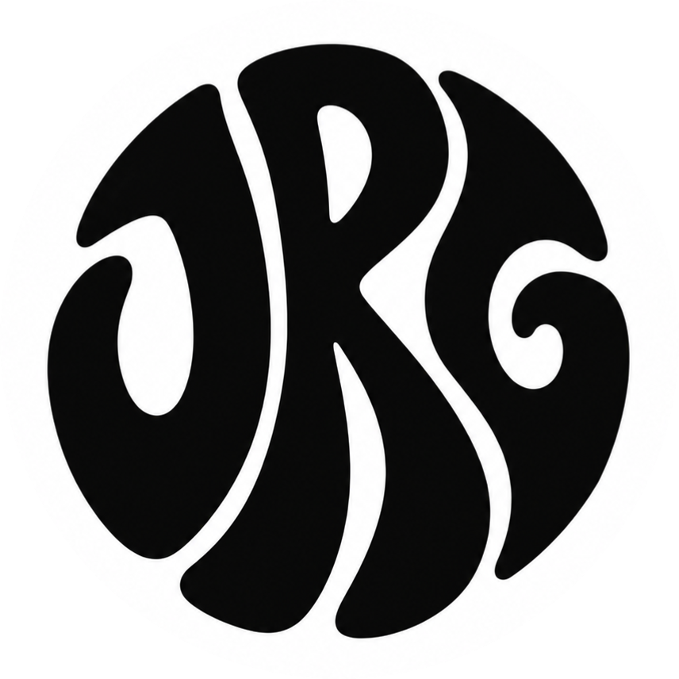

<p align="center">
  
</p>

<h1 align="center">⚡ JRG Agency — Web Portfolio & Experiencias 3D</h1>

<p align="center">
  <strong>Desarrollo Web de Alto Rendimiento · Experiencias 3D Inmersivas · Diseño Vanguardista</strong><br>
  <em>Desde Urretxu, País Vasco, España</em>
</p>

<p align="center">
  
  
  
  
  
  
</p>

---

## 🌟 Sobre JRG Agency

Sitio web oficial y portafolio interactivo de **JRG Agency**, especializado en el diseño y desarrollo de aplicaciones web de alto rendimiento, interfaces interactivas de última generación y experiencias tridimensionales inmersivas en el navegador.

---

## ✨ Características Principales

- 🎮 **Experiencia 3D Interactiva:** Integración avanzada de WebGL mediante **Three.js** y **React Three Fiber (@react-three/fiber, @react-three/drei)**, con iluminación dinámica, animaciones de entrada y modelos renderizados en tiempo real.
- 🎬 **Animaciones Cinemáticas y Scroll Trigger:** Líneas de tiempo milimétricamente coreografiadas con **GSAP** y **ScrollTrigger**, con fijación de secciones (*pinning*) y transiciones de texto fluidas.
- 🌊 **Smooth Scrolling Profesional:** Desplazamiento ultra suave impulsado por **Lenis**, sincronizado en tiempo real con los espaciadores dinámicos de GSAP.
- 🌌 **Fondo Animado e Interactivo:** Canvas interactivo personalizado con efectos fluidos y estéticos.
- 📱 **Diseño Totalmente Responsive:** Adaptabilidad completa para smartphones, tablets y pantallas de escritorio de alta resolución.
- 💼 **Showcase de Proyectos y Trayectoria:** Secciones visuales dedicadas a proyectos destacados, trayectoria y stack técnico.
- 📞 **Centro de Contacto Directo:** Acceso rápido a WhatsApp, Email corporativo, redes sociales y ubicación geográfica.

---

## 🧰 Stack Tecnológico

| Área | Tecnologías |
| :--- | :--- |
| **Frontend Core** | React 18, TypeScript, HTML5 Semántico, CSS3 Moderno |
| **3D & Gráficos** | Three.js, React Three Fiber, Drei, WebGL Shaders |
| **Animación & Física** | GSAP (GreenSock), ScrollTrigger, Lenis Smooth Scroll |
| **Herramientas de Build** | Vite, Terser, ESLint |
| **Analítica & Rendimiento** | Vercel Analytics, Speed Insights |

---

## 🚀 Instalación y Desarrollo Local

Sigue estos pasos para clonar y ejecutar el proyecto en tu entorno local:

### 1. Clonar el repositorio
```bash
git clone https://github.com/jakesroodriguez/JRG-agency.git
cd JRG-agency
```

### 2. Instalar dependencias
```bash
npm install
```

### 3. Iniciar el servidor de desarrollo
```bash
npm run dev
```
Abre tu navegador en `http://localhost:5173/`.

### 4. Compilar para producción
```bash
npm run build
```
Los archivos optimizados y empaquetados se generarán en la carpeta `dist/`.

---

## 📁 Estructura del Proyecto

```plaintext
├── public/                     # Recursos estáticos (logos, modelos 3D, texturas)
├── src/
│   ├── components/             # Componentes modulares de la interfaz
│   │   ├── Character/          # Escena 3D, controladores de luces y animaciones
│   │   ├── styles/             # Hojas de estilo CSS modulares
│   │   ├── utils/              # Funciones auxiliares de GSAP, scroll y texto
│   │   ├── About.tsx           # Sección sobre JRG Agency
│   │   ├── Contact.tsx         # Pie de página y tarjetas de contacto
│   │   ├── Landing.tsx         # Hero section principal
│   │   ├── Navbar.tsx          # Barra de navegación interactiva y Lenis
│   │   ├── WhatIDo.tsx         # Servicios y especialidades
│   │   └── Work.tsx            # Galería horizontal de proyectos destacados
│   ├── context/                # Proveedores de contexto (Loading, temas)
│   ├── pages/                  # Vistas auxiliares
│   ├── App.tsx                 # Componente raíz y enrutador
│   └── main.tsx                # Punto de entrada de la aplicación
├── package.json
└── vite.config.ts
```

---

## 📬 Contacto y Canales

- 📍 **Ubicación:** Urretxu, País Vasco, España
- 📧 **Email:** [jakessrodriguezz@gmail.com](mailto:jakessrodriguezz@gmail.com)
- 📱 **WhatsApp / Teléfono:** [+34 613 44 81 85](https://wa.me/34613448185)
- 🐙 **GitHub:** [@jakesroodriguez](https://github.com/jakesroodriguez)

---

## 📄 Licencia

Este proyecto está bajo la Licencia MIT. Consulta el archivo [LICENSE](LICENSE) para más detalles.
